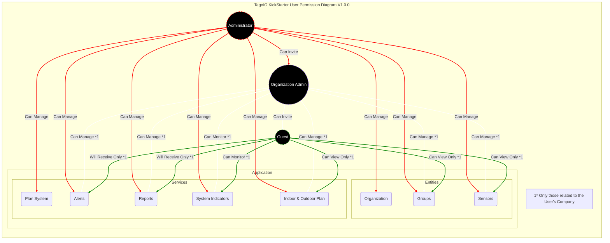

 

  </img>

# Kickstarter Application for TagoIO
This is a starter application to be used at TagoIO. It has main required features for an regular application to run, with a functionality to facilitate setting up new sensors within the application. You can use the scripts provided here to learn or to develop your own solution with it's foundations.

# Components
The application contains the following features:
* Two levels: Organization and Groups.
* Three access levels: Super Administrator, Organization Administrator and Guest User.
* Organization plans for managing SMS, email and data retetion.
* Setup alerts.
* Generate scheduled reports.
* Navigation between dashboards and Run Buttons enabled.

### Easy Installation
You can quickly install the application in your account by using the Import tool.
* Firstly, make sure your RUN is activated. Visit this [link](https://admin.tago.io/run/), click on "Start now" and then save the change. 
* Go to your [profile settings](https://admin.tago.io/account/).
* Generate an Token in your profile, make sure to set **expire time** to never.
* Copy the Token.
* Access the Import tool by [clicking here](https://import-application.tago.run/dashboards/info/63e698562df1360009606d71?anonymousToken=00000000-5bbc-b03b-667d-7a002e56664b).
* Keep all entities selected, paste your token in the account token field.
* Press Import Application and you should receive notification in your account when it's done.
* To access the application using TagoRUN. Make sure to create a user using your TagoIO Developer account, adding the tag key **access** with the tag value **admin**.

### Easy Update
To easy update your application when new version is out, you can just repeat the previous step.
If you had made changes to the application, you can choose only the entities you want to update, like only analysis for example.

### Step-by-Step installation
You only want to follow this installation method, instead of the easy one, if you plan to have deep understading of how all TagoIO resources works and are used. I can't think of any other reason to go through this method.

* Generate an account-token in your profile settings.
* Create a Custom HTTPs device, to be used as a internal storage for the application. Make sure you have the tag key **device_type** with tag value **settings** on it.
* Get Analysis and Dashboard templates from [Analysis documentation](https://github.com/tago-io/analysis-kickstarter/blob/master/src/analysis/README.md).
* Create actions as described in the header documentation on each analysis file at [Analysis folder](https://github.com/tago-io/analysis-kickstarter/tree/master/src/analysis).
* Create policies for your Run Users (work in progress)
* Create the Run Buttons (work in progress)
* Follow the **Code Setup and Installation** instructions below, to make sure scripts are up-to-date.
* You're done!

### Code Setup and Installation
Using this repository, you will be able to change and update the analysis in your account. This step is not required unless you plan to make changes in the code.
* Install [Node.JS](https://help.tago.io/portal/en/kb/articles/464-node-js).
* Download the repository.
* Open your terminal and access the folder of the repository.
* Run `npm install`.
* Generate a account-profile token at TagoIO **My Settings** -> **Your Profile** -> **Tokens**. Make sure to generate a token with `Expire at` set to never.
* Open the `build.ts` and replace `Your-Account-Profile-Token` by a token of your profile.
* Go back to your terminal and run the template with `npm run start build`.
* It should take a few minutes for the script to build and import all the analysis and dashboards to your account.

### Code Update
* Make sure you have the `build.ts` with your account profile token.
* Update the repository with last version.
* Go back to your terminal and run the template with `npm run start build`.
* It should take a few minutes for the script to build and import all the analysis and dashboards to your account.

### How to use the application
The documentation on how to use the application is avaiable to download in the following link [analysis-kickstarter/docs/Kickstarter-Guide](https://github.com/tago-io/analysis-kickstarter/blob/master/docs/Kickstarter%20-%20Guide.pdf).

### How to learn from this code
You will notice three folders in the `src/` folder.
* **analysis**: contains each analysis that must be present in your account.
* **lib**: useful list of functions commonly used between the scripts.
* **services**: services folders that are used in the analysis. Each service is related 

For additional informations on how to setup TagoIO with this code, and all the TagoIO resources used, check the Kickstarter Guide documentation at [analysis-kickstarter/docs/Kickstarter-Guide](https://github.com/tago-io/analysis-kickstarter/blob/master/docs/Kickstarter%20-%20Guide.pdf).

### User Permissions Diagram

### Support
You can open an issue or question at [https://github.com/tago-io/analysis-kickstarter/issues](https://github.com/tago-io/analysis-kickstarter/issues).
