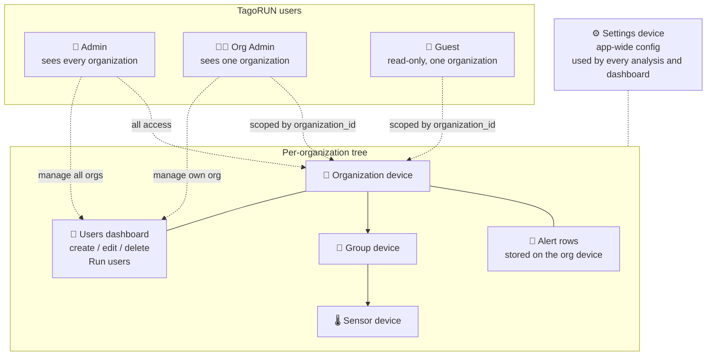
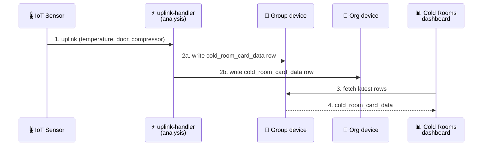
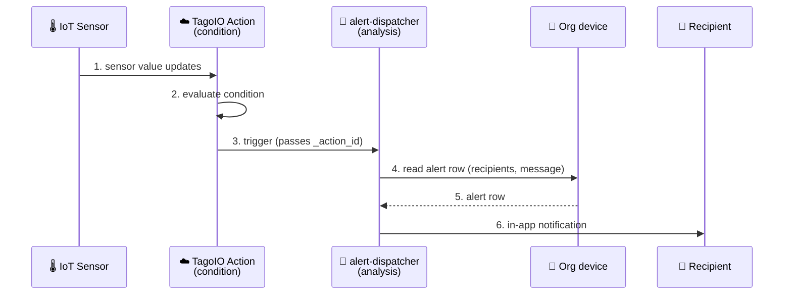

<br/>
<p align="center">
  </img>
</p>

# Kickstarter

A multi-tenant cold-room monitoring application that runs on TagoIO. Each customer (Organization) owns sites (Groups), each site has IoT sensors that report temperature, compressor
state, and door state, and operators get notified the moment something drifts. Six dashboards, three custom React widgets, and eight server-side analyses — every piece you need to
deploy a working application.

This template uses Deno end-to-end. Custom widgets run on Vite + React + Tailwind. Helper docs ship in English and Portuguese.

## Concepts (TagoIO 101)

Eight concepts you need to recognise to read this codebase. Each links to the canonical doc on `docs.tago.io`.

- **[Analysis](https://docs.tago.io/docs/tagoio/analysis/)** — server-side code that runs on TagoIO. This template uses analyses for CRUD logic and event handlers (uplinks, alerts,
  scheduled checks).
- **[Custom Widget](https://docs.tago.io/docs/tagoio/widgets/custom-widget)** — React app rendered inside a dashboard iframe. This template ships three: `sensor-status`,
  `cold-room-card-data`, and `cold-room-monitor`.
- **[Device](https://docs.tago.io/docs/tagoio/devices/)** — storage container for variables. Devices here are either real sensors or dummy devices that store organization and group
  metadata.
- **[Tag](https://docs.tago.io/docs/tagoio/getting-started/tags-system)** — key/value pair on any TagoIO resource. This template relies on `device_type`, `organization_id`, and
  `group_id` tags to enforce tenancy.
- **[Action](https://docs.tago.io/docs/tagoio/actions/)** — server-side trigger (variable condition, schedule, resource change). Used here for per-alert conditions and the
  scheduled inactivity check.
- **[Run user](https://docs.tago.io/docs/tagoio/tagorun/getting-started/user-management)** — end-user account that logs into TagoRUN. This template has three roles: Admin,
  Organization Admin, and Guest.
- **[Access Management](https://docs.tago.io/docs/tagoio/tagorun/access-management/)** — how this template isolates tenants. Each Run user carries `organization_id` and `access`
  tags; access rules use those tags to decide what each user can see and do.
- **[Blueprint Dashboard](https://docs.tago.io/docs/tagoio/dashboards/blueprint-dashboard)** — the dashboard pattern that lets one shared dashboard switch scope per user (org /
  group / sensor). Every dashboard in this template is a Blueprint.
- **[Dictionary](https://docs.tago.io/docs/tagoio/tagorun/getting-started/language-preferences)** — TagoIO's translation system that swaps a `#KEY#` placeholder for the right text
  based on the Run user's language. This template uses a dictionary called `VAL` to translate the strings emitted by analyses and widgets.

## Easy Installation

You can quickly install the application in your account by using the Import tool.

- Firstly, make sure your RUN is activated. Visit this [link](https://admin.tago.io/run/), click on "Start now" and then save the change.
- Go to your [profile settings](https://admin.tago.io/account/).
- Generate a Token in your profile, make sure to set **expire time** to never.
- Copy the Token.
- Access the Import tool by [clicking here](https://import-application.tago.run/dashboards/info/63e698562df1360009606d71?anonymousToken=00000000-5bbc-b03b-667d-7a002e56664b).
- Keep all entities selected, paste your token in the account token field.
- Add you account token to a new secret named: ACCOUNT_TOKEN, it is needed to allow Analysis to work.
- Press Import Application and you should receive notification in your account when it's done.
- To access the application using TagoRUN. Make sure to create a user using your TagoIO Developer account, adding the tag key **access** with the tag value **admin**.

## Quick Start

For developers who want to clone the repo, run it locally, and explore or modify the code. If you just want to install the application as-is, use the
[Easy Installation](#easy-installation) section above instead.

Five steps to get the template running locally and pushed to your TagoIO account.

### Prerequisites

- [Deno](https://deno.com/) — install with `deno upgrade` or your package manager
- [TagoIO CLI](https://github.com/tago-io/tagoio-cli) — `npm install -g @tago-io/cli`
- A TagoIO account ([sign up here](https://tago.io/signup) if you don't have one)

### Steps

```bash
# 1. Clone and install workspace dependencies
git clone https://github.com/tago-io/analysis-kickstarter.git
cd analysis-kickstarter
deno install

# 2. Authenticate the TagoIO CLI against your account
tagoio login

# 3. Build every custom widget into widgets/_dist/<name>/
deno task build:widgets

# 4. Create the analyses, widgets, and dashboards on TagoIO
#    See section "Deploying to TagoIO" below for the full flow.

# 5. Open the deployed application in your browser
#    (the URL appears in your TagoIO admin once you wire the dashboards)
```

Need detail on any step? See [Deploying to TagoIO](#deploying-to-tagoio) for the full flow.

## Application model

The diagram below shows the device tree on the TagoIO side and the three TagoRUN user personas that consume it. The settings device sits outside the per-organization subgraph
because it is shared across the whole application — every analysis and every dashboard URL carries `?settings_dev=…`.


```mermaid
flowchart TD
  SET[⚙️ Settings device<br/>app-wide config<br/>used by every analysis and dashboard]

  subgraph TENANT["Per-organization tree"]
    direction TB
    ORG[🏢 Organization device]
    GRP[📍 Group device]
    SNS[🌡️ Sensor device]
    ALR[🚨 Alert rows<br/>stored on the org device]
    USRD[👥 Users dashboard<br/>create / edit / delete<br/>Run users]

    ORG --- ALR
    ORG --> GRP
    GRP --> SNS
    ORG --- USRD
  end

  subgraph USERS["TagoRUN users"]
    direction TB
    ADM[👑 Admin<br/>sees every organization]
    OAD[🧑‍💼 Org Admin<br/>sees one organization]
    GST[👀 Guest<br/>read-only, one organization]
  end

  SET -.- TENANT

  ADM -. all access .-> ORG
  OAD -. scoped by organization_id .-> ORG
  GST -. scoped by organization_id .-> ORG

  ADM -. manage all orgs .-> USRD
  OAD -. manage own org .-> USRD
```

The hierarchy is enforced through device tags: `organization_id` and `group_id` propagate down so [Access Management](https://docs.tago.io/docs/tagoio/tagorun/access-management/)
isolates tenants automatically.

### Data flow

Two lifelines explain "what happens when".

**Sensor uplink** — a sensor reports values, the dashboard renders them:


```mermaid
sequenceDiagram
  participant SNS as 🌡️ IoT Sensor
  participant UPH as ⚡ uplink-handler<br/>(analysis)
  participant GRP as 📍 Group device
  participant ORG as 🏢 Org device
  participant DASH as 📊 Cold Rooms<br/>dashboard

  SNS->>UPH: 1. uplink (temperature, door, compressor)
  UPH->>GRP: 2a. write cold_room_card_data row
  UPH->>ORG: 2b. write cold_room_card_data row
  DASH->>GRP: 3. fetch latest rows
  GRP-->>DASH: 4. cold_room_card_data
```

**Alert dispatch** — a threshold is crossed, a recipient sees a notification:


```mermaid
sequenceDiagram
  participant SNS as 🌡️ IoT Sensor
  participant TIO as ☁️ TagoIO Action<br/>(condition)
  participant DSP as 🚨 alert-dispatcher<br/>(analysis)
  participant ORG as 🏢 Org device
  participant USR as 👤 Recipient

  SNS->>TIO: 1. sensor value updates
  TIO->>TIO: 2. evaluate condition
  TIO->>DSP: 3. trigger (passes _action_id)
  DSP->>ORG: 4. read alert row (recipients, message)
  ORG-->>DSP: 5. alert row
  DSP->>USR: 6. in-app notification
```

Inactivity alerts do not take this path — they run from the scheduled `check-inactive-sensors` analysis, which polls each sensor's `last_input` on a cron and notifies recipients
directly.

## Dashboards

Six dashboards, every one with a `Helper` tab that renders the matching file in [`dashboard-helpers/`](./dashboard-helpers).

| Dashboard     | Tabs                                    | CRUD analysis (in [`app/analysis/dashboard/`](./app/analysis/dashboard/)) | Custom widget                                                                |
| ------------- | --------------------------------------- | ------------------------------------------------------------------------- | ---------------------------------------------------------------------------- |
| Organizations | Overview (List + Map) · Helper          | `crud-organization.ts`                                                    | —                                                                            |
| Groups        | Cold Rooms · Overview · Helper          | `crud-group.ts`                                                           | [`cold-room-card-data`](./widgets/cold-room-card-data) on the Cold Rooms tab |
| Sensors       | Overview · All Devices (Admin) · Helper | `crud-sensor.ts`                                                          | [`sensor-status`](./widgets/sensor-status) on Overview                       |
| Sensor Detail | Overview · Helper                       | —                                                                         | [`cold-room-monitor`](./widgets/cold-room-monitor) on Overview               |
| Alerts        | Overview · Global Alerts · Helper       | `crud-alert.ts`                                                           | —                                                                            |
| Users         | Overview · All Users (Admin) · Helper   | `crud-user.ts`                                                            | —                                                                            |

Each CRUD analysis is dispatched by the SDK's `AnalysisRouter` based on the widget that fired the call (input form, custom button, or device-list action). The full mapping is
documented in [`app/README.md`](./app/README.md).

Three more analyses run outside of any dashboard:

- `actions/uplink-handler.ts` — Action-triggered. Turns each sensor uplink into the `cold_room_card_data` row that powers the Cold Rooms widget.
- `actions/alert-dispatcher.ts` — Action-triggered. Called by the per-alert Action created by `crud-alert.ts` whenever a condition is met.
- `scheduled/check-inactive-sensors.ts` — Scheduled (hourly). Flags sensors that haven't reported within the configured threshold and refreshes the connectivity summary shown on
  the Sensors dashboard.

## Project layout

```
analysis-kickstarter/
├── app/                 # Deno workspace — Analyses + bundle script
├── widgets/             # Vite/React workspace — one subfolder per widget
├── dashboard-helpers/   # Markdown files rendered inside each dashboard's Helper tab
└── deno.json            # Root workspace + top-level tasks
```

Detailed docs live next to the code:

- [`app/README.md`](./app/README.md) — analyses, triggers, AnalysisRouter, bundling
- [`widgets/README.md`](./widgets/README.md) — widget stack, dev server, build

## Deploying to TagoIO

### Analyses

Each file under `app/analysis/**` is a self-contained source file with no relative imports. It is shaped that way **on purpose**: the goal is that any developer can open the
analysis directly on TagoIO and read the code top-to-bottom without bundled or minified output getting in the way.

#### Deploy to TagoIO

You can paste each file into the matching analysis on TagoIO by hand. The faster path is the TagoIO CLI, which reads `tagoconfig.json` and pushes the code to the matching analysis
ID on your account.

```bash
# Push every analysis listed in tagoconfig.json
tagoio deploy

# Push a single analysis by name
tagoio deploy crud-user
```

#### Run locally

While developing, you can execute an analysis from your machine instead of deploying first. The CLI streams logs to your terminal and uses the analysis token from
`tagoconfig.json`.

```bash
# Execute an analysis locally (uses the analysis env vars from TagoIO)
tagoio run crud-user

# Trigger the deployed analysis on TagoIO and tail the live console
tagoio at crud-user      # remotely trigger
tagoio ac crud-user      # stream the analysis console
```

### Custom widgets

`deno task build:widgets` produces a fully self-contained bundle per widget under `widgets/_dist/<name>/`.

1. Upload the contents of `widgets/_dist/<name>/` to TagoIO Files.
2. On the dashboard that hosts the widget, open the Custom Widget configuration.
3. Set the widget URL to the hosted `index.html`.

For local development with live reload, point a tunnel (ngrok, Cloudflare Tunnel) at `localhost:1234` — the workflow lives in [`widgets/README.md`](./widgets/README.md).

### Dictionary

The `VAL` dictionary ships with the application export, so it is provisioned automatically when you import the template into your TagoIO account.

How it works at runtime:

- Analyses emit `#VAL.<KEY>#` placeholders in their output.
- Widgets resolve the same keys through the SDK's `Dictionary` class.
- The Run user's language preference picks which translation is returned.

Common edits:

- **Edit an existing translation.** Change the value in the TagoIO admin. No code change needed.
- **Add a new key.** Three steps:
  1. Register the new key in the TagoIO dictionary.
  2. Reference it in the code — `#VAL.NEW_KEY#` inside an analysis, or append it to the `WIDGET_KEYS` and `EN_BASELINE` constants at the top of a widget's `App.tsx` and call
     `t("NEW_KEY")`.
  3. Redeploy that analysis or widget.

## Adapting to your use case

This template is shaped around cold-room monitoring, but every layer is generic enough to repurpose.

- **Swap the variables.** Change `cold_room_card_data` to your own variable name in `widgets/cold-room-card-data/` and update `app/analysis/actions/uplink-handler.ts` to write the
  matching rows from your sensors.
- **Add an alert model.** Add a new branch to the Zod model union in `app/analysis/dashboard/crud-alert.ts`, mirror it in `app/analysis/actions/alert-dispatcher.ts`, and surface
  the new input on the Alerts dashboard.
- **Add a user role.** Extend the `access` tag enum in `app/analysis/dashboard/crud-user.ts` and add the matching rules in
  [Access Management](https://docs.tago.io/docs/tagoio/tagorun/access-management/) on TagoIO.
- **Add a language to the in-app strings.** Add a new language to the TagoIO `VAL` dictionary with translations for every key the analyses and widgets reference. The widgets
  resolve at runtime via the Run user's `language` setting — no code change needed. The Helper docs under `dashboard-helpers/` are a separate, English/Portuguese-only choice;
  translate those files only if your dashboards point at them.

## Development

Run from the repo root:

| Task                      | What it does                                        |
| ------------------------- | --------------------------------------------------- |
| `deno task build:app`     | Bundle every analysis into `build/app/*.tagoio.js`  |
| `deno task build:widgets` | Build every widget into `widgets/_dist/<name>/`     |
| `deno task dev:widgets`   | Start the widget dev server (needs `WIDGET=<name>`) |
| `deno task test:all`      | Run app tests                                       |
| `deno task lint:all`      | Lint app and widgets                                |
| `deno task fmt`           | Format everything (`deno fmt`)                      |

Per-workspace task lists live in the folder READMEs.

## Resources

- [`app/README.md`](./app/README.md) — analyses deep dive
- [`widgets/README.md`](./widgets/README.md) — widget toolchain deep dive
- [docs.tago.io](https://docs.tago.io/) — official platform docs
- [community.tago.io](https://community.tago.io/) — community forum
